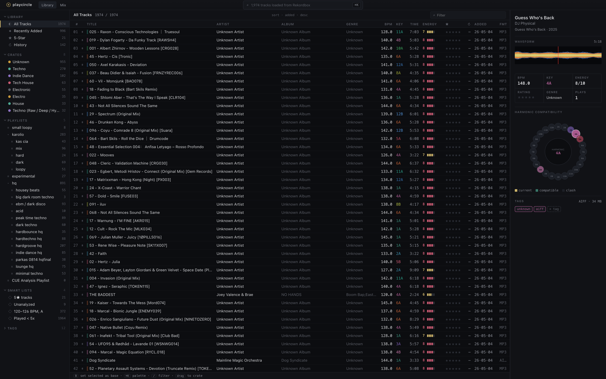
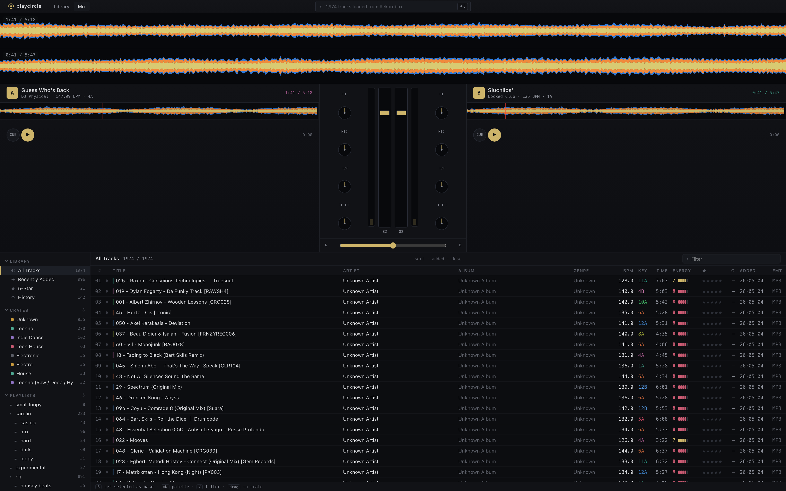

# Playcircle

Playcircle is an open-source alternative DJing app for local music libraries,
practice sessions, and preparation workflows. It is being built as a desktop
app for DJs who want a fast, inspectable, local-first tool instead of a closed
DJ library and playback environment.

The current app focuses on validating the core DJ workflow: browse a library,
load tracks to two decks, inspect metadata and waveforms, play audio, seek
through tracks, adjust deck levels and filters, and work with Rekordbox-derived
library data while the native playback and library engine continues to mature.

## Screenshots

### Library



### Mix



## Functionality

- Library browsing with track metadata, playlists/crates, search, filtering,
  sorting, multi-selection, and drag-to-crate interactions.
- Rekordbox library import for tracks, playlists, metadata, file paths, analysis
  paths, and beat grids from the local Rekordbox database format.
- Two-deck playback through a Rust audio engine.
- Deck loading, play/pause, seeking, cue state, deck volume, master volume, and
  low-pass filter controls.
- Waveform generation from local audio files for visual browsing and deck
  interaction.
- Browser fixture mode for UI/performance testing without running the Tauri
  shell.
- Performance scripts for library loading, sorting, audio loading, and decode
  benchmarks.

Planned product areas include a SQLite-backed native library, playlist editing,
hot cues, beatgrid editing, BPM detection, DDJ-FLX4 controller support, mixer EQ,
basic FX, recording, and M3U import/export.

## Tech Stack

- **Desktop shell:** Tauri v2.
- **Frontend:** React, TypeScript, Vite, and Tailwind CSS.
- **Native backend:** Rust commands exposed to the frontend through Tauri
  `invoke` APIs.
- **Audio:** `cpal` for output streaming and `symphonia` for decoding MP3, AAC,
  ALAC, FLAC, AIFF, WAV, PCM, and MP4-family audio containers.
- **Library import:** `rusqlite` with bundled SQLCipher/OpenSSL support for
  reading Rekordbox databases.
- **Testing and performance:** Playwright for frontend/performance checks, Rust
  tests and examples for crate-level validation and benchmarks.

## Architecture

Playcircle is split into a React frontend and a small Rust workspace:

```text
src/
  frontend/        React UI, data mapping, and Tauri API wrappers
  app/             Tauri desktop app and command bridge
  audio/           Rust playback, decoding, deck, mixer, and waveform logic
  rekordbox/       Rust Rekordbox database and analysis readers
tests/perf/        Playwright performance checks
scripts/          Local helper scripts for fixtures and benchmarks
public/           Browser fixtures and static frontend data
```

### Frontend

The frontend owns the DJ workspace UI: sidebar navigation, track table, filters,
inspector, top bar, and player dock. It talks to the native layer through small
API modules in `src/frontend/api/`.

When running in browser fixture mode, the frontend reads
`public/rekordbox-demo-tracks.json`. In the Tauri app, the same API wrappers call
native Rust commands.

### Tauri Command Layer

`src/app` is the desktop entry point. It registers commands for Rekordbox library
loading, beat grid loading, waveform extraction, deck loading, playback, seeking,
deck filters, cue state, and master volume.

This layer keeps the frontend decoupled from native implementation details while
preserving a narrow command surface between TypeScript and Rust.

### Audio Engine

`src/audio` contains the native playback engine. It creates an output stream with
`cpal`, decodes files with `symphonia`, streams decoded frames into deck buffers,
mixes two decks, applies per-deck volume and low-pass filtering, and soft-clips
the master output.

Deck commands are sent to the audio thread over channels so UI commands do not
write directly into the audio callback.

### Rekordbox Import

`src/rekordbox` reads Rekordbox track and playlist data from a read-only
SQLCipher-backed SQLite database. It maps Rekordbox rows into typed Rust structs
that are serialized back to the frontend.

The crate also resolves Rekordbox analysis paths and parses beat grid data where
available.

## Prerequisites

- Node.js and npm
- Rust and Cargo
- Tauri system dependencies for your operating system

## Install

```sh
npm install
```

## Run the Web App

Start the Vite development server:

```sh
npm run dev
```

Open <http://localhost:1420> in your browser.

To run against the generated Rekordbox fixture in the browser, use:

```sh
npm run fixture:rekordbox
npm run dev
```

Then open <http://localhost:1420/?fixture=rekordbox>.

## Run the Desktop App

Start the Tauri desktop app with Vite hot reload:

```sh
npm run tauri:dev
```

Frontend changes hot reload through Vite. Rust/Tauri changes are watched by
`tauri dev` and restart the app process.

## Build

Build the frontend:

```sh
npm run build
```

Build the Tauri app:

```sh
npm run tauri:build
```

## Preview

Preview the production frontend build:

```sh
npm run preview
```

The preview server runs at <http://127.0.0.1:1420>.

## Tests and Checks

Run the Rust test suite:

```sh
cargo test
```

Run the Playwright tests:

```sh
npx playwright test
```

## Fixtures and Performance Scripts

Generate the Rekordbox demo fixture:

```sh
npm run fixture:rekordbox
```

Available performance scripts:

```sh
npm run perf:load
npm run perf:library
npm run perf:sort
npm run perf:audio
npm run perf:decode
```
